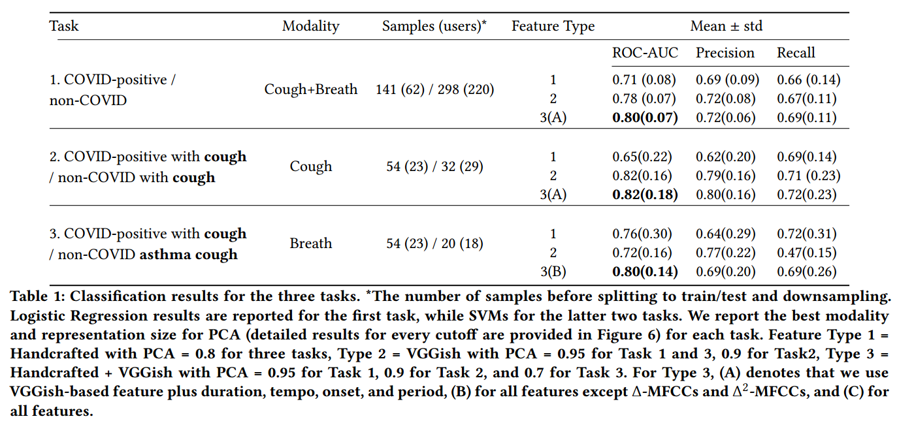

# Training and Performance

These scripts show how we evaluate our model. 

After conducting pipiline python script, you can get a series of csv files, showing the performance under different parameters.

For your convenience, we also provide a notebook to quickly check the main results in Table1 of our KDD paper.

